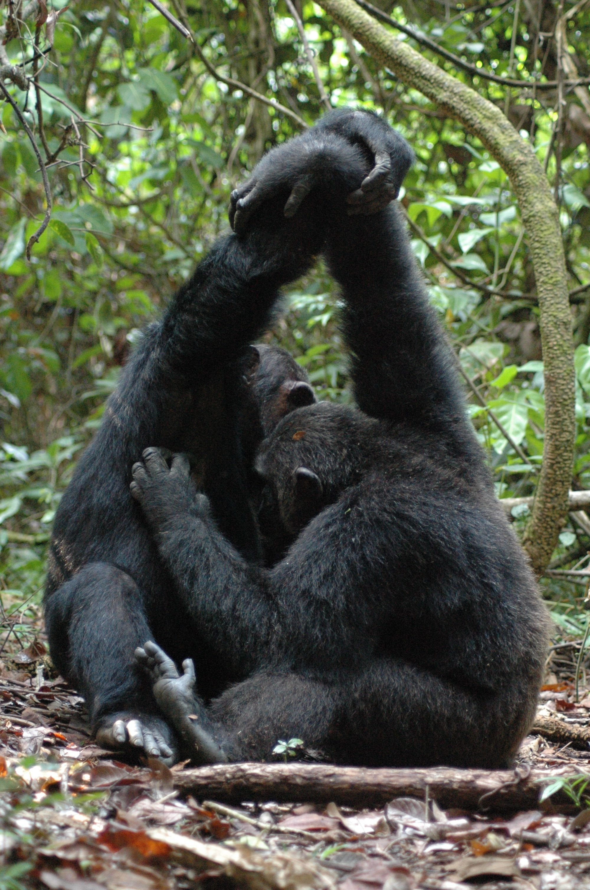

<!--
*** Thanks for checking out the Best-README-Template. If you have a suggestion
*** that would make this better, please fork the repo and create a pull request
*** or simply open an issue with the tag "enhancement".
*** Thanks again! Now go create something AMAZING! :D
-->


<!-- PROJECT SHIELDS -->
<!--
*** I'm using markdown "reference style" links for readability.
*** Reference links are enclosed in brackets [ ] instead of parentheses ( ).
*** See the bottom of this document for the declaration of the reference variables
*** for contributors-url, forks-url, etc. This is an optional, concise syntax you may use.
*** https://www.markdownguide.org/basic-syntax/#reference-style-links
-->

[![MIT License][license-shield]][license-url]


<!-- PROJECT LOGO -->
<br />
<p align="center">
  <a href="https://github.com/othneildrew/Best-README-Template">
    
  </a>

  <h3 align="center">Ape GUI</h3>

  <p align="center">
    Detect Grooming hand clasp in Apes
    <br />
    <br />
    <br />
  </p>
</p>


<!-- TABLE OF CONTENTS -->
<details open="open">
  <summary>Table of Contents</summary>
  <ol>
    <li>
      <a href="#about-the-project">About The Project</a>
      <ul>
        <li><a href="#built-with">Built With</a></li>
      </ul>
    </li>
    <li>
      <a href="#getting-started">Getting Started</a>
      <ul>
        <li><a href="#prerequisites">Prerequisites</a></li>
        <li><a href="#installation">Installation</a></li>
      </ul>
    </li>
    <li><a href="#usage">Usage</a></li>
    <li><a href="#roadmap">Roadmap</a></li>
    <li><a href="#contributing">Contributing</a></li>
    <li><a href="#license">License</a></li>
    <li><a href="#contact">Contact</a></li>
    <li><a href="#acknowledgements">Acknowledgements</a></li>
  </ol>
</details>


<!-- ABOUT THE PROJECT -->
## About The Project

[![Product Name Screen Shot][product-screenshot]](https://imgur.com/Ovgb63s)

In this work, we present two methods wrapped into a GUI that can primarily detect Grooming Hand Clasp(GHC) postures among  Chimpanzees in the wild.The methods use underlying properties of the ‘GHC’ converted into a pseudo-algorithm.

We use the outputs from a [deeplabcut](https://github.com/DeepLabCut/DeepLabCut) network trained using images of Grooming and non-Grooming postures of chimpanzees in the wild.The method is not just restricted to one particular network and can be easily customized to use outputs from other supervised CNN models too.In broad sense, we want to show an intuitive way to find solutions for problems that is rather can not be easily solvable using just a neural architecture. 
The publication accompanying this work can be previwed here.


### Built With

This section should list any major frameworks that you built your project using. Leave any add-ons/plugins for the acknowledgements section. Here are a few examples.
* [tkinter](https://docs.python.org/3/library/tkinter.html)
* [Deeplabcut](https://github.com/DeepLabCut/DeepLabCut)
* [ffmpeg](http://ffmpeg.org/)


<!-- GETTING STARTED -->
## Getting Started
Here, we will shortly explain how to use this GUI in your system.Please create a separete [virtual environment](https://docs.python.org/3/library/venv.html) and install [Python 3.7](https://www.python.org/downloads/release/python-370/) in that to use this.(For other versions of python, there are chances that you might run into dependency issues.)As the program depends on multiple packages with different versions, having a virtual environment can keep all the packages required for running a program in one place. So, I would recommend doing so. 

### Prerequisites

This is an example of how to list things you need to use the software and how to install them.
* tensorflow 
* deeplabcut 
* ffmpeg-python
  ```sh
  tensorflow==1.15
  deeplabcut==2.1.8
  ffmpeg-python==0.2.0
  ```
### Installation

1.Download the apeapp folder.This contains the weights of the deeplabcut model that we trained.
2.Create the vitual envirnment and install python 3.7.The link for both have been provided above.
3.Install the required libraries individually or use the requirment.txt file.
```sh
pip requirements.txt
```
4.using the command line activate your virtual environment
5.If your folder is in the Desktop, you would type something like this 
```sh
 py C:/Users/User/Desktop/apeapp/app.py
 ```
 It will take a moment for the GUI to start up.
 How to use this GUI and it's various functions are explained in detail below.

<!-- USAGE EXAMPLES -->
## Usage

The GUI comes in a five layer format. This includes downsampling the videos to the required size of  532* 300 pixels for efficient analysis  using the weights of a trained DLC model to analyze the videos.This creates hdf format files with pixel positions(x,y) of the 28 labels for every frame with their likelihood value of detection ( ranging between 0 and 1) for each frame in the video.
The GUI works like this:
 
Frame1:** Downsample**

Click and select the folder with videos to downsample and change the frame rates to 25fps.

]


<!-- ROADMAP -->
## Roadmap

See the [open issues](https://github.com/othneildrew/Best-README-Template/issues) for a list of proposed features (and known issues).


<!-- CONTRIBUTING -->
## Contributing

Contributions are what make the open source community such an amazing place to be learn, inspire, and create. Any contributions you make are **greatly appreciated**.

1. Fork the Project
2. Create your Feature Branch (`git checkout -b feature/AmazingFeature`)
3. Commit your Changes (`git commit -m 'Add some AmazingFeature'`)
4. Push to the Branch (`git push origin feature/AmazingFeature`)
5. Open a Pull Request


<!-- LICENSE -->
## License

Distributed under the MIT License. See `LICENSE` for more information.


<!-- CONTACT -->
## Contact

Your Name - [@your_twitter](https://twitter.com/your_username) - email@example.com

Project Link: [https://github.com/your_username/repo_name](https://github.com/your_username/repo_name)


<!-- ACKNOWLEDGEMENTS -->
## Acknowledgements
* [GitHub Emoji Cheat Sheet](https://www.webpagefx.com/tools/emoji-cheat-sheet)
* [Img Shields](https://shields.io)
* [Choose an Open Source License](https://choosealicense.com)
* [GitHub Pages](https://pages.github.com)
* [Animate.css](https://daneden.github.io/animate.css)
* [Loaders.css](https://connoratherton.com/loaders)
* [Slick Carousel](https://kenwheeler.github.io/slick)
* [Smooth Scroll](https://github.com/cferdinandi/smooth-scroll)
* [Sticky Kit](http://leafo.net/sticky-kit)
* [JVectorMap](http://jvectormap.com)
* [Font Awesome](https://fontawesome.com)


<!-- MARKDOWN LINKS & IMAGES -->
<!-- https://www.markdownguide.org/basic-syntax/#reference-style-links -->
[contributors-shield]: https://img.shields.io/github/contributors/othneildrew/Best-README-Template.svg?style=for-the-badge
[contributors-url]: https://github.com/othneildrew/Best-README-Template/graphs/contributors
[forks-shield]: https://img.shields.io/github/forks/othneildrew/Best-README-Template.svg?style=for-the-badge
[forks-url]: https://github.com/othneildrew/Best-README-Template/network/members
[stars-shield]: https://img.shields.io/github/stars/othneildrew/Best-README-Template.svg?style=for-the-badge
[stars-url]: https://github.com/othneildrew/Best-README-Template/stargazers
[issues-shield]: https://img.shields.io/github/issues/othneildrew/Best-README-Template.svg?style=for-the-badge
[issues-url]: https://github.com/othneildrew/Best-README-Template/issues
[license-shield]: https://img.shields.io/github/license/othneildrew/Best-README-Template.svg?style=for-the-badge
[license-url]: https://github.com/othneildrew/Best-README-Template/blob/master/LICENSE.txt
[linkedin-shield]: https://img.shields.io/badge/-LinkedIn-black.svg?style=for-the-badge&logo=linkedin&colorB=555
[linkedin-url]: https://linkedin.com/in/othneildrew
[product-screenshot]: images/screenshot.png
